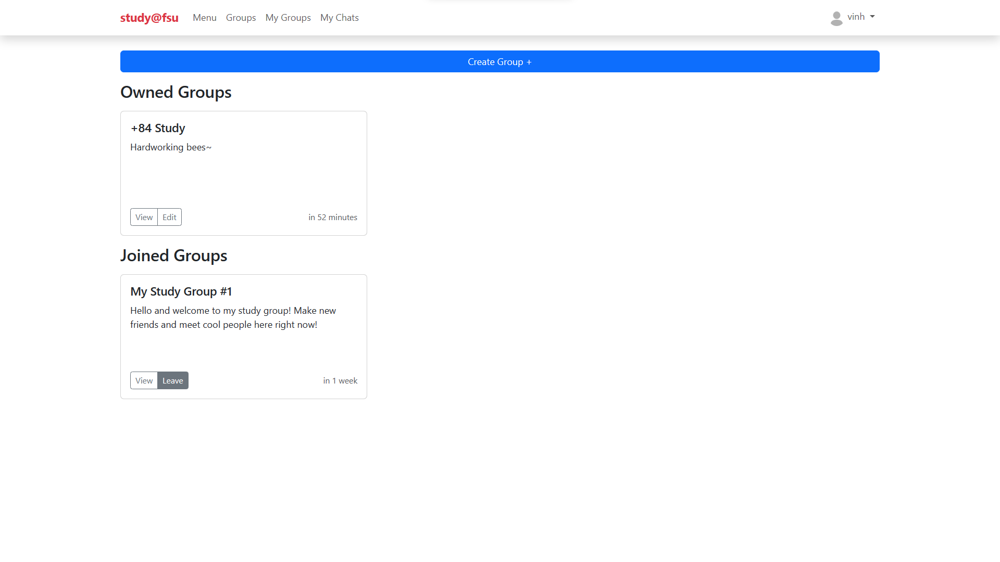
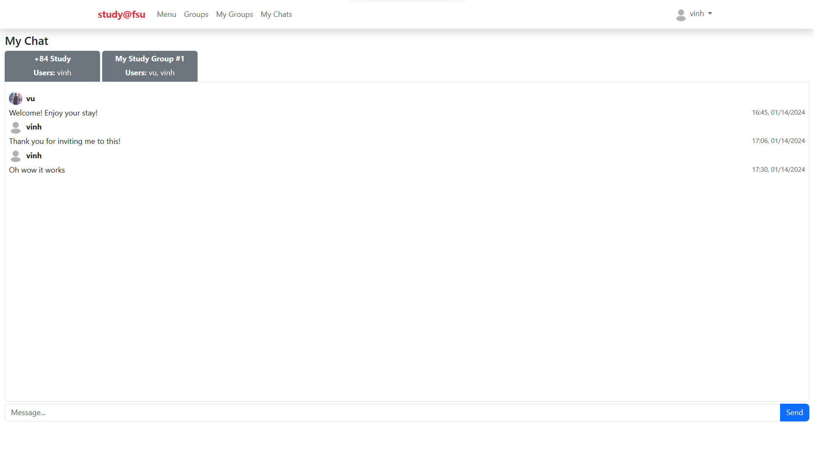

# study@fsu



[Link to demo video](https://youtu.be/IU5q7DMfWRQ)

### Introduction
study@fsu is a web application that allows students in Florida State University to find and participate in public study groups.

### Distinctiveness and Complexity
When I arrived at my school's library for the first time, I got fascinated by the idea of a study room that I can book for multiple hours a day for me and my friends. Sometimes, I and my friends would go to one of the study rooms that we booked, but we wouldn't use up all of the seats. Why won't we invite other people to our study room as well (the more the merrier)? What if we could find students working on the same subject through an app?

study@fsu hopes to connect people studying the same subject to the same location, from online to IRL. I believe this web application is distinct as it has the potential of addressing many potential problems that has not been addressed in my school or in other schools such as:
- Office hours or school's study groups are reserved.
- An all-in-one tool for organizing study groups for multiple different subjects.
- Lack of socializing due to heavy workload.
- Unoccupied seats in library (useful in high times such as finals)

The application is built with HTML & CSS, JavaScript, Bootstrap for the front-end and Python & Django for the back-end. I believe the application achieved a fair level of complexity because:
- The application was partly built with the knowledge not being taught during the course or used in the course's projects, such as:
    - All of the pages are mobile-responsive utilizing Bootstrap's Modal, Form, Navbar, Alert, Button,...
    - Real-life chat function for study group participants using Django's WebsocketConsumer, ASGI and InmemoryChannelLayer backend
    - Upload profile picture with Django's ImageField
    - Set timezone for project, changing between Django's DateTimeField, Python's datetime, JavaScript's Date(), and strings.
    - "Add to Calendar" button with third-party integration.
- The application also leveraged what was learned throughout the projects:
    - Search bar (from Project 1)
    - The use of @login_required decorator (from Project 2)
    - Update page upon current user's editing, joining/leaving study group without reloading page (from Project 3)
    - Pagination of twelve groups per page (from Project 4)
- Also, there are rigorous conditions when creating/editing group to make sure the security of the application such as:
    - Opened for users who logged in only
    - A user can only create three new groups at max
    - End time must be after start time, and start time must be after current time.
    - Maximum participants must be greater than current participants.

Obviously, the application is built with the purpose of connecting like-minded students. However, this is not the same as Project 4: Social Network since there are crucial features in Project 4 that makes it a social network which lacks in this application. This application does not have features such as "Add Post", "Following", or "Like/Unlike". Also, Project 4 lacks features compared to this application as well.

### Quickstart
```
cd path/to/project
pip install -r requirements.txt
python manage.py makemigrations
python manage.py migrate
python manage.py runserver
```

### Explanation of folders and files:
- demo_img: stores demo pictures for README.md
- media/profile_pics: stores user's profile pictures
- study: directory of Django's project
    - asgi.py: stores ASGI config
    - settings.py: stores project's settings
    - urls.py: stores project's URLs
- studygroup: directory of Django's application
    - migrations: stores changes of models
    - static: stores JavaScript and CSS files
    - templates: stores HTML files
    - admin.py: stores registered models
    - consumers.py: handles Websocket connections
    - models.py: stores declared models
    - routing.py: stores Websocket connection's URL
    - urls.py: stores application's URLs
    - views.py: stores views for each URL
- manage.py: main program for running the project
- requirements.txt: contains needed libraries
